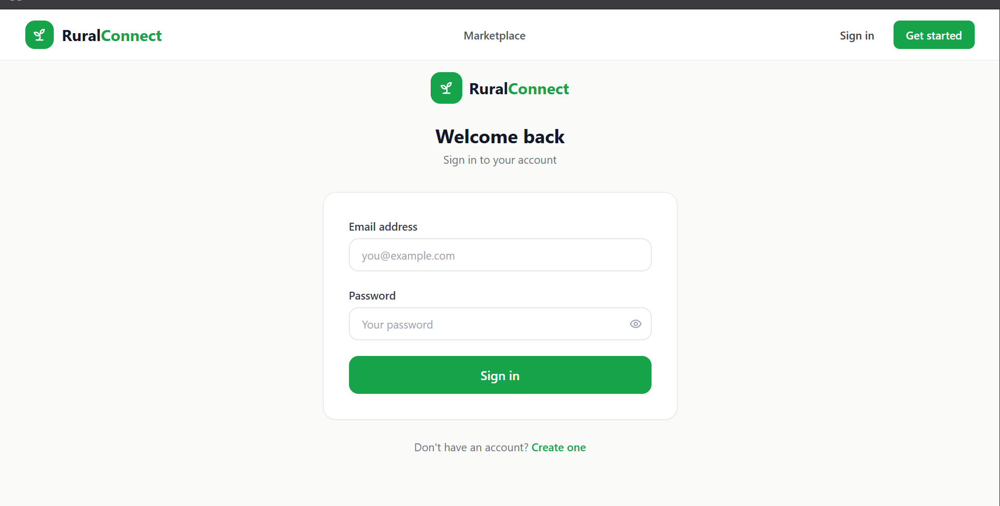
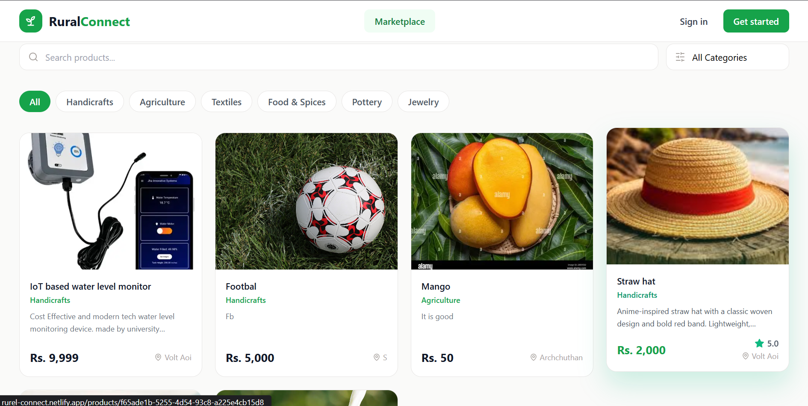

# 🌿 RuralConnect

**RuralConnect** is a web-based digital marketplace designed to connect **farmers, rural artisans, and small businesses** with customers. The platform aims to empower rural communities by providing an accessible online marketplace where local producers can showcase and sell their products directly to consumers.

---

## 🚀 Live Demo

🔗 https://rurel-connect.netlify.app/

---

## 📖 Project Overview

Many rural producers struggle to reach a wider customer base due to limited market access and dependence on intermediaries. RuralConnect addresses this challenge by offering a modern digital platform that enables sellers to promote their products while allowing customers to discover authentic rural goods from anywhere.

The system provides a clean, responsive, and user-friendly interface, making online buying and selling simple and accessible.

---

## ✨ Key Features

- 🛍️ Browse authentic rural products
- 👨‍🌾 Support farmers and rural artisans
- 🔍 Easy product discovery
- 📱 Fully responsive design
- ⚡ Modern and intuitive user interface
- 🔐 User authentication
- 📦 Product management
- 🌐 Web-based marketplace

---

## 🏗️ Project Structure

```text
RuralConnect/
│
├── src/                    # React frontend source code
├── spring-boot/            # Spring Boot backend
├── supabase/               # Database migrations and configuration
├── public/                 # Static assets
├── package.json
└── README.md
```

---

## 🛠️ Tech Stack

### Frontend
- React
- TypeScript
- Vite
- Tailwind CSS

### Backend
- Spring Boot
- Java

### Database
- Supabase

### Development Tools
- Visual Studio Code
- Git
- GitHub

### Deployment
- Netlify

---

## 🏛️ System Architecture

```text
Customer
      │
      ▼
React + TypeScript Frontend
      │
      ▼
Spring Boot REST API
      │
      ▼
Supabase Database
```

---

## 🎯 Project Objectives

- Connect rural producers directly with customers
- Increase market access for local businesses
- Promote authentic rural products
- Reduce dependency on intermediaries
- Support rural economic development
- Deliver a simple and user-friendly online shopping experience

---

## 👥 Target Users

- Farmers
- Rural Artisans
- Small Businesses
- Customers

---

## 💡 Skills & Technologies Applied

- Frontend Development
- Backend Development
- Responsive Web Design
- UI/UX Design
- REST API Integration
- Database Management
- Component-Based Development
- Team Collaboration
- Version Control with Git & GitHub

---

## 📸 Screenshots

> Add screenshots of:
- Home Page
- Marketplace
- Product Details
- Login / Registration
- Responsive Mobile View

---

## 🚀 Future Improvements

- Online Payment Integration
- Order Tracking
- Product Reviews & Ratings
- AI-Based Product Recommendations
- Multilingual Support (Sinhala, Tamil & English)
- Seller Analytics Dashboard
- Wishlist Feature
- Advanced Search & Filtering

---

## 👨‍💻 Team

Developed as a program construction project by **Cyber Penguins**.
Team Members
- E.Thanancheyan 240645V
- S.Sivakumaran 240628X
- S.Archchuthan 240043A
- V.Banujan 240062F
- S.Arun 240047N

---

## 📄 License

This project was developed for educational purposes.
## 📸 Screenshots

### Home Page


### Marketplace


### Login Page



### Admin Page


### Product Details



## 🎥 Project Demo

[Watch Demo Video on Google Drive](https://drive.google.com/drive/folders/1e6qtAbn4djYKdyW6iju1ACw22j5Q9tCo)

